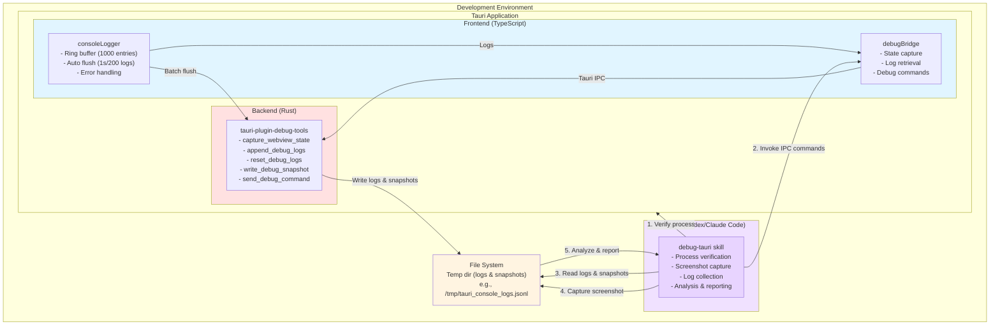

# tauri-plugin-debug-tools

Comprehensive debug utilities for Tauri WebView applications with AI-powered automated debugging workflows.

## Features

- **WebView State Capture** - Capture URL, title, viewport, and User-Agent
- **Console Log Collection** - Ring-buffer based log collection with batched flushing
- **Screenshot Integration** - System screenshot command integration
- **AI Agent Skill** - Automated debugging workflow for AI agents
- **Debug Snapshots** - Save comprehensive debug state to disk
- **Event-based Communication** - Send debug commands to frontend via Tauri events

## Quick Start

### Installation

Add to your Tauri project's `Cargo.toml`:

```toml
[dependencies]
tauri-plugin-debug-tools = "0.1.0"
```

Install the frontend package:

```bash
npm install tauri-plugin-debug-tools
# or
bun add tauri-plugin-debug-tools
```

### Setup

**1. Register the plugin** in your Tauri app:

```rust
// src-tauri/src/main.rs or lib.rs
fn main() {
    tauri::Builder::default()
        .plugin(tauri_plugin_debug_tools::init())
        .run(tauri::generate_context!())
        .expect("error while running tauri application");
}
```

**2. Configure the plugin (optional)** in your `tauri.conf.json` if you want to override defaults:

```json
{
    "plugins": {
        "debug-tools": {
            "timeout": 30
        }
    }
}
```

If you don't need custom configuration, you can omit this section.

**3. Enable permissions** in `src-tauri/capabilities/default.json`:

```json
{
  "permissions": [
    "debug-tools:default"
  ]
}
```

    **4. Initialize frontend logger** in your app entry point:

```typescript
// src/main.ts or src/App.tsx
import { debugTools } from "tauri-plugin-debug-tools/consoleLogger";

// Use instead of console.*
debugTools.log("Application started");
debugTools.error("Something went wrong");

// Or import individual functions
import { log, error, warn } from "tauri-plugin-debug-tools/consoleLogger";
```

## Usage

### Frontend API

#### Console Logging

```typescript
import { debugTools, consoleLogger } from "tauri-plugin-debug-tools/consoleLogger";

// Log messages (automatically collected)
debugTools.log("Info message");
debugTools.warn("Warning message");
debugTools.error("Error message", { context: "data" });

// Retrieve logs
const allLogs = consoleLogger.getLogs();
const errors = consoleLogger.getErrors();
const recent = consoleLogger.getRecentLogs(50);

// Get statistics
const stats = consoleLogger.getStats();
// { total: 150, byLevel: { log: 100, warn: 30, error: 20, info: 0, debug: 0 } }
```

#### WebView State Inspection

```typescript
import { captureWebViewState } from "tauri-plugin-debug-tools/debugBridge";

const state = await captureWebViewState();
console.log(state);
// {
//   url: "http://localhost:5173",
//   title: "My App",
//   user_agent: "TauriWebView/2.0",
//   viewport: { width: 1200, height: 800 }
// }
```

#### Debug Commands

```typescript
import { sendDebugCommand } from "tauri-plugin-debug-tools/debugBridge";

// Send event-based commands to frontend
await sendDebugCommand("refresh_state", { force: true });
```

### Backend Commands

All commands are available through the Tauri IPC system:

| Command | Description | Output |
| ------- | ----------- | ------ |
| `capture_webview_state` | Capture WebView state | `WebViewState` JSON |
| `get_console_logs` | Legacy console logs | Empty array (use frontend logger) |
| `send_debug_command` | Send event to frontend | Success message |
| `append_debug_logs` | Append logs to file | System temp dir (e.g., `/tmp/tauri_console_logs.jsonl`) |
| `reset_debug_logs` | Clear log file | File path |
| `write_debug_snapshot` | Save debug snapshot | System temp dir (e.g., `/tmp/tauri_debug_snapshot_*.json`) |

## AI Agent Skill

### Skill Installation

Copy the bundled skill to your agent's skills directory:

(example: Codex)

```bash
cp -R skills/debug-tauri ~/.codex/skills/debug-tauri
```

Or for custom skill directories:

```bash
cp -R skills/debug-tauri /path/to/your/skills/debug-tauri
```

### Skill Usage

Invoke the skill to start automated debugging:

```bash
/debug-tauri
```

The skill will:

1. ✅ Verify the app process is running
2. 📸 Capture a screenshot
3. 📝 Collect console logs (via IPC)
4. 🔍 Analyze visual and runtime state
5. 📄 Generate a comprehensive debug report
6. 💡 Propose fixes based on findings

### Example Report

```markdown
# Tauri Debug Report - 2025-12-31T22:00:00Z

## Screenshot
/tmp/tauri_debug_1735689600.png

## Process Status
- Status: Running
- PID: 12345

## Console Logs
### Recent Errors
- [ERROR] WebGL context lost (timestamp: 1735689550)
- [ERROR] Failed to load texture.png (timestamp: 1735689555)

### Log Statistics
- Total: 1,234 logs
- Errors: 2
- Warnings: 15

## Visual Analysis
### UI State
Main window visible with rendering artifacts in canvas area.

### Recommendations
1. Investigate WebGL context loss - check GPU driver
2. Verify texture.png exists in public/ directory
```

## Architecture



## Log Collection System

The plugin uses a sophisticated ring-buffer based logging system:

- **Buffer Size**: Max 1,000 log entries (automatically drops oldest)
- **Batch Flushing**: Every 1 second or 200 pending logs
- **Auto-initialization**: Starts on module load
- **Error Handling**: Catches global `error` and `unhandledrejection` events
- **Stack Traces**: Automatically captures and normalizes stack traces
- **Zero Config**: No Safari DevTools required

## Development

```bash
# Install dependencies
bun install

# Build TypeScript
npm run build

# Lint
npm run lint

# Format
npm run format
```

## Platform Support

- ✅ macOS (tested)
- ⚠️ Windows (uses system temp directory for logs/snapshots)
- ⚠️ Linux (uses system temp directory for logs/snapshots)

## License

This project is licensed under either of:

- Apache License, Version 2.0 ([LICENSE-APACHE](LICENSE-APACHE) or <http://www.apache.org/licenses/LICENSE-2.0>)
- MIT license ([LICENSE-MIT](LICENSE-MIT) or <http://opensource.org/licenses/MIT>)

at your option.

## Contributing

Contributions are welcome! Please feel free to submit a Pull Request.

## Related Projects

- [Tauri](https://tauri.app) - Build smaller, faster, and more secure desktop applications
- [Codex](https://github.com/anthropics/anthropic-sdk-typescript) - AI-powered code assistant
